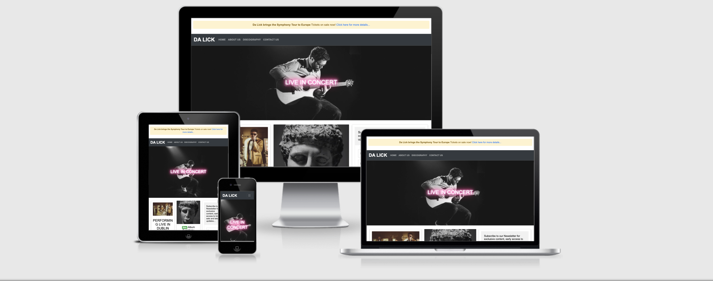
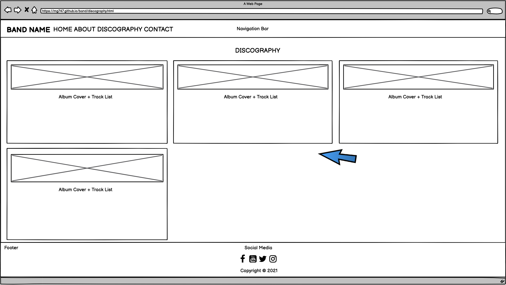
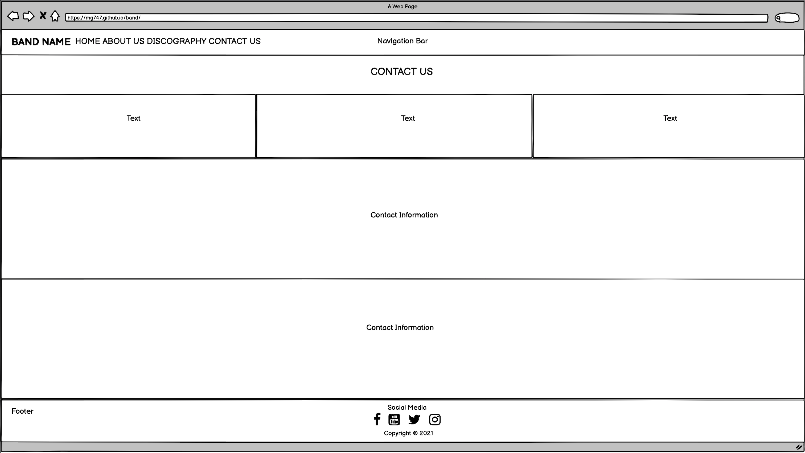

<h1 align="center">P1 Band Website</h1>

[View the live project here.](https://mg747.github.io/band/)


#### Band Name: Da Lick
#### Genre: Alternative, Hip-Hop

## Contents
* [User Experience Design (UX)](#User-Experience-Design)
    * [User Stories](#User-Stories)
        * [First Time Visitor Goals](#First-Time-Visitor-Goals)
        * [Returning Visitor Goals](#Returning-Visitor-Goals)
        * [Frequent User Goals](#Frequent-User-Goals)

    * [Design](#Design)
        * [Colour Scheme](#Colour-Scheme)
        * [Typography](#Typography)
        * [Imagery](#Imagery)        
   
    * [Wireframes](#Wireframes)
        * [Desktop View](#Desktop-View)
        
* [Features](#Features)
* [Technologies Used](#Technologies-Used)
* [Languages Used](#Languages-Used)
* [Frameworks Libraries & Programs Used](Frameworks-Libraries-&-Programs-Used)

* [Testing](#Testing)
* [Testing User Stories from User Experience (UX) Section](Testing-User-Stories-from-User-Experience-(UX)-Section)
* [Further Testing](Further-Testing)
* [Known Bugs](Known-Bugs)
    
* [Deployment](#Deployment)
    * [GitHub Pages](#Deployment-To-Heroku)
    * [Forking the GitHub Repository](#Forking-the-GitHub-Repository)
    * [Making a Local Clone](#Making-a-Local-Clone)

* [Credits](#Credits)
    * [Code](#Code)
* [Content](#Content)
* [Media](#Media)
* [Acknowledgements](#Acknowledgements)

## User Experience (UX)

-   ### User stories

    -   #### First Time Visitor Goals

        1. As a First Time Visitor, I want to easily understand the main purpose of the site and learn more about the band.
        2. As a First Time Visitor, I want to be able to easily navigate throughout the site to find content.
        3. As a First Time Visitor, I want to look for testimonials to understand what their fans think of them and know why they are so successful. 
        4. As a First Time Visitor, I want to sign up to the Band Newsletter so that I am emailed any major news or updates. 

    -   #### Returning Visitor Goals

        1. As a Returning Visitor, I want to see information about upcoming shows and tickets availability.
        2. As a Returning Visitor, I want to find the best way to get in contact with the band with any questions I may have. 

    -   #### Frequent User Goals
        1. As a Frequent User, I want to check to see if there are any news and/or updates.
        2. As a Frequent User, I want to see information about upcoming shows and tickets availability..
        3. As a Frequent User, I want to sign up to the Band Newsletter so that I am emailed any major updates and/or changes to the website or upcoming events.

-   ### Design
    -   #### Colour Scheme
        -   The two main colours used are Code Insititue black, and white.
    -   #### Typography
        -   The Arial font is the main font used throughout the whole website with Helvetica and Sans Serif as the fallback font in case for any reason the font isn't being imported into the site correctly. Arial is a clean font used frequently in programming, so it is both attractive and appropriate.
    -   #### Imagery
        -   Imagery is important. The Hero Image is designed to be striking and catch the user's attention. It also has a modern, energetic aesthetic.

*   ## Wireframes

-   #### Desktop View

#### Home Page Skeleton Plane


#### About Us Page Skeleton Plane


#### Discography Page Skeleton Plane


#### Contact Us Page Skeleton Plane


## Features

-   Responsive on all device sizes

-   Interactive elements

## Technologies Used

### Languages Used

-   [HTML5](https://en.wikipedia.org/wiki/HTML5)
-   [CSS3](https://en.wikipedia.org/wiki/Cascading_Style_Sheets)

### Frameworks, Libraries & Programs Used

1. [Bootstrap 4.5:](https://getbootstrap.com/docs/4.5/getting-started/introduction/)
    - Bootstrap was used to assist with the responsiveness and styling of the website.
2. [Hover.css:](https://ianlunn.github.io/Hover/)
    - Hover.css was used on the Social Media icons in the footer to add the float transition while being hovered over.
3. [Font Awesome 4.7:](https://fontawesome.com/)
    - Font Awesome was used on all pages throughout the website to add icons for aesthetic and UX purposes.
4. [jQuery:](https://jquery.com/)
    - jQuery came with Bootstrap to make the navbar responsive but was also used for the smooth scroll function in JavaScript.
5. [Git](https://git-scm.com/)
    - Git was used for version control by utilizing the Gitpod terminal to commit to Git and Push to GitHub.
6. [GitHub:](https://github.com/)
    - GitHub is used to store the projects code after being pushed from Git.
7. [Balsamiq:](https://balsamiq.com/)
    - Balsamiq was used to create the [wireframes](https://github.com/) during the design process.

## Testing

The W3C Markup Validator and W3C CSS Validator Services were used to validate every page of the project to ensure there were no syntax errors in the project.

-   [W3C Markup Validator](https://jigsaw.w3.org/css-validator/#validate_by_input) - [Results](https://github.com/)
-   [W3C CSS Validator](https://jigsaw.w3.org/css-validator/#validate_by_input) - [Results](https://github.com/)

### Testing User Stories from User Experience (UX) Section

-   #### First Time Visitor Goals

    1. As a First Time Visitor, I want to easily understand the main purpose of the site and learn more about the band.

        1. Upon entering the site, users are automatically greeted with a clean and easily readable navigation bar  alert about the band tour, underneath that is the navigation bar to go to the page of their choice. Underneath there is a Hero Image with Text.(assets/images/screenshot1.png)
        2. The main points are made immediately with the navigation bar, the Hero Image with Live In Concert text.

    2. As a First Time Visitor, I want to easily be able to navigate throughout the site to find content.

        1. The site has been designed to be fluid and never to entrap the user. At the top of each page there is a clean navigation bar, each link describes what page they will end up at clearly.
        2. The band name is on the top left of the navigation bar as the site header, when clicked on; it returns the user back to the Home page of the site.

    3. As a First Time Visitor, I want to look for testimonials to understand what their fans think of them and know why they are so successful. I also want to locate their social media links to see their followers.
        
        1. Once the new visitor has read the About Us and what we do text, they will know why we have such a successful career and why we are loved so much by fans all over the World.(assets/images/screenshot2.png) 
        2. The user can also scroll to the bottom of any page of the site to locate our social media links in the footer.(assets/images/screenshot3.png)

    4. As a First Time Visitor, I want to sign up to the Band Newsletter so that I am emailed any major news or updates.

        1. There is a "Subscribe to our Newsletter" short form with Name and Email Address input on the right, underneath the hero image on the Home page.(assets/images/screenshot4.png)
        
-   #### Returning Visitor Goals

    1. As a Returning Visitor, I want to find news and check if there's new music or video and information about upcoming events.

        1. These are clearly shown underneath the Hero Image. To the left is an image with text about upcoming show in Dublin with a buy tickets button that will redirect a user to the official ticket site to purchase tickets and beside it is an Album cover of the Band new music. (assets/images/screenshot5.png) Underneath the album cover, there is a music video.(assets/images/screenshot6.png) 
    
    2. As a Returning Visitor, I want to find the best way to get in contact with the band with any questions I may have.

        1. The navigation bar clearly highlights the "Contact Us" Page.
        2. The footer contains links to the band Facebook, Youtube, Twitter and Instagram page.
        3. On the Contact Us page, there is email and telephone contact information of the band agent, management and press relation for booking and general enquiry.(assets/images/screenshot7.png)

-   #### Frequent User Goals

    1. As a Frequent User, I want to see updates about the band upcoming shows and tickets availability.

        1. The user would already be comfortable with the website layout and can easily see information table about upcoming shows and tickets availability at the bottom of the Home page, underneath the band photo carousel.(assets/images/screenshot8.png)

    2. As a Frequent User, I want to check to see if there are any new blog posts.

        1. The user would already be comfortable with the website layout and can easily click the social media links in the footer, at the bottom of every page of the site.

    3. As a Frequent User, I want to sign up to the Band Newsletter so that I am emailed any major updates and/or changes to the website or upcoming event.
        
        1. The user would already be comfortable with the website layout and can easily see "Subscribe to our Newsletter" short form on the right underneath the hero image on the Home page.

### Further Testing

-   The Website was tested on Google Chrome, Mozilla Firefox, Microsoft Edge and Safari browsers.
-   The website was viewed on a variety of devices such as Desktop, Laptop, iPhone X, iPhone SE and Samsung Galaxy A5 and iPad.
-   A large amount of testing was done to ensure that all pages were linking correctly.
-   Friends and family members were asked to review the site and documentation to point out any bugs and/or user experience issues.

### Known Bugs

-   On some mobile devices the nav alert on the homepage doesn't show any information, instead it shows a white space but information appears on desktop and tablets. pushes the size of screen out more than any of the other content on the page.
    -   A white gap can be seen to the right of the contact page on desktop and tablet devices and navigation bar and footer of the page as a result.

## Deployment

### GitHub Pages

The project was deployed to GitHub Pages using the following steps...

1. Log in to GitHub and locate the [GitHub Repository](https://github.com/)
2. At the top of the Repository (not top of page), locate the "Settings" Button on the menu.
    - Alternatively Click [Here](https://raw.githubusercontent.com/) for a GIF demonstrating the process starting from Step 2.
3. Scroll down the Settings page until you locate the "GitHub Pages" Section then click to open Github pages tab.
4. Under "Source", click the dropdown called "None" and select "Master Branch".
5. The page will automatically refresh.
6. Scroll back down through the page to locate the now published site [link](https://mg747.github.io/band/) in the "GitHub Pages" section.

### Forking the GitHub Repository

By forking the GitHub Repository we make a copy of the original repository on our GitHub account to view and/or make changes without affecting the original repository by using the following steps...

1. Log in to GitHub and locate the [GitHub Repository](https://mg747.github.io/band/)
2. At the top of the Repository (not top of page) just above the "Settings" Button on the menu, locate the "Fork" Button.
3. You should now have a copy of the original repository in your GitHub account.

### Making a Local Clone

1. Log in to GitHub and locate the [GitHub Repository](https://mg747.github.io/band/)
2. Under the repository name, click "Clone or download".
3. To clone the repository using HTTPS, under "Clone with HTTPS", copy the link.
4. Open Git Bash
5. Change the current working directory to the location where you want the cloned directory to be made.
6. Type `git clone`, and then paste the URL you copied in Step 3.

```
$ git clone https://github.com/YOUR-USERNAME/YOUR-REPOSITORY
```

7. Press Enter. Your local clone will be created.

```
$ git clone https://github.com/YOUR-USERNAME/YOUR-REPOSITORY
> Cloning into `CI-Clone`...
> remote: Counting objects: 10, done.
> remote: Compressing objects: 100% (8/8), done.
> remove: Total 10 (delta 1), reused 10 (delta 1)
> Unpacking objects: 100% (10/10), done.
```

Click [Here](https://help.github.com/en/github/creating-cloning-and-archiving-repositories/cloning-a-repository#cloning-a-repository-to-github-desktop) to retrieve pictures for some of the buttons and more detailed explanations of the above process.

## Credits

### Code

-   The Hero Image neon text effect code was copied and modified from this [CSS Tutorial](https://freefrontend.com/css-glow-text-effects)

-   Home page nav alert code was copied and modified from beyond bootstrap lesson on the course User Centric Frontend Development module.

-   Home page table, Discography column cards and Social Media icon css code were copied and modified from [w3schools](https://www.w3schools.com)

-   Bootstrap Library was used throughout the project mainly to make site responsive using the Bootstrap Grid System [Bootstrap4.5](https://getbootstrap.com/docs/4.5/getting-started/introduction/)

### Content

-   All content was written by the developer.

### Media

-   All Images, Audio and Video copyrights belongs to the artist and/or organisation mentioned in code comments.

### Acknowledgements

-   My Mentor Dick Vlaanderen for his helpful guidiance and feedback.

-   Tutor support at Code Institute for their support.

### Author

-   Morgan Ugiagbe